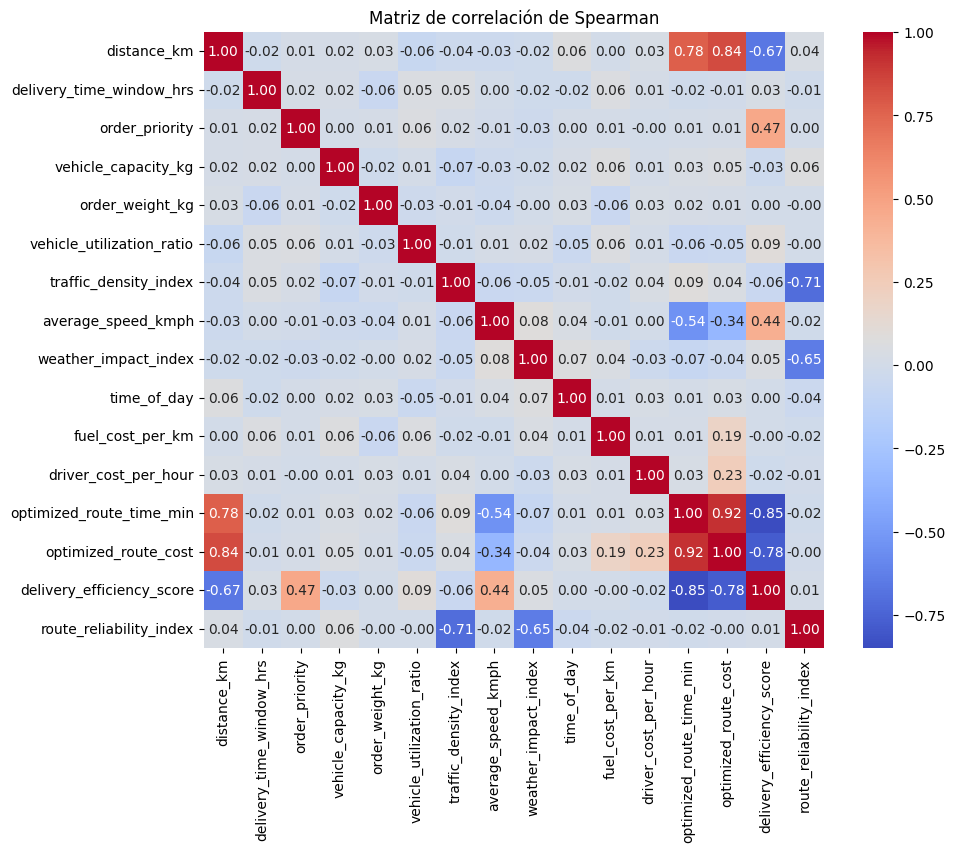
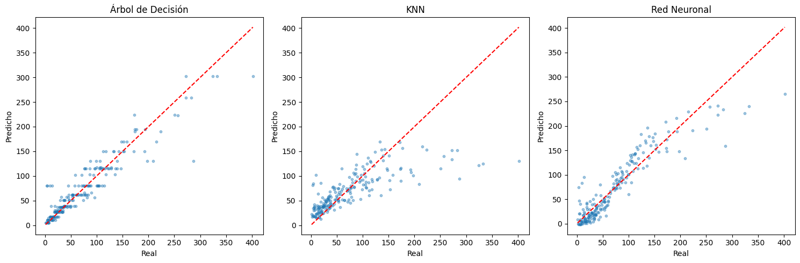
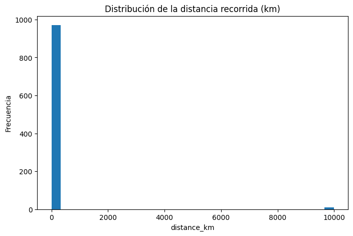
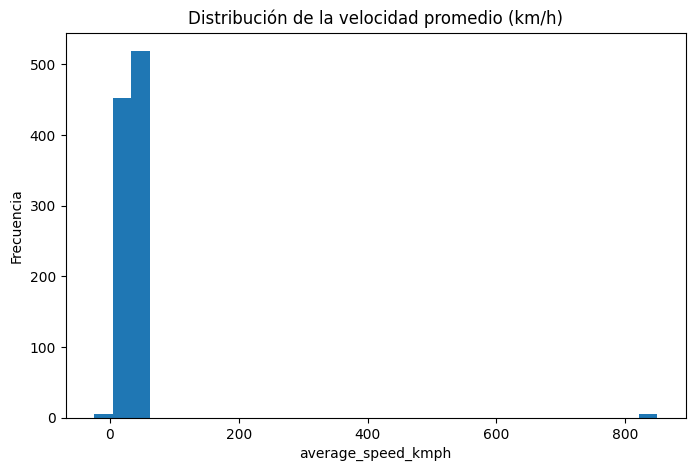
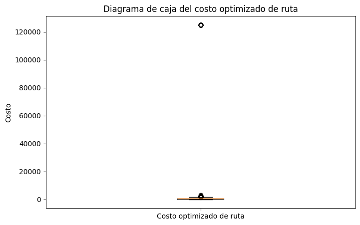
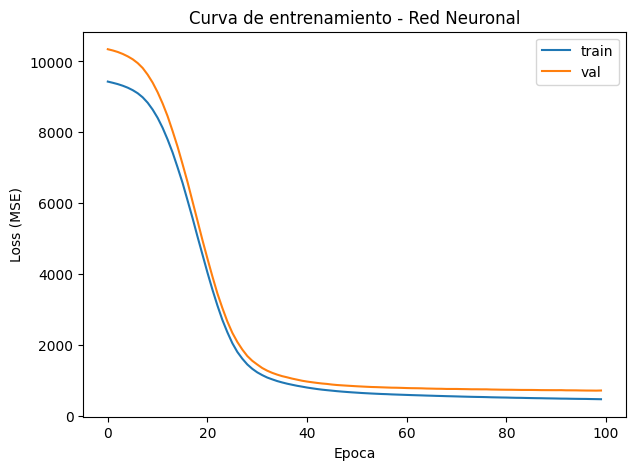

# 01 · Optimización de Rutas en E-Commerce

**Auditoría de calidad de datos y modelado predictivo del tiempo de ruta**

---

## El problema

Una operación de reparto de e-commerce necesita anticipar **cuánto tardará una
ruta** (`optimized_route_time_min`) para planificar ventanas de entrega,
asignación de vehículos y costos. El dataset de partida
(`dirty_ecommerce_logistics_route_planning_dataset.csv`) llega con problemas de
calidad deliberados: nulos, duplicados, velocidades negativas y distancias
imposibles.

El trabajo se divide en dos fases: **auditar y sanear los datos**, y luego
**entrenar y comparar modelos predictivos**.

---

## Fase 1 · Auditoría y limpieza

### Diagnóstico inicial

| Problema detectado | Alcance |
|---|---|
| Valores nulos | 6 variables afectadas, entre **4.76 % y 4.85 %** cada una |
| Registros duplicados | **14 filas** (1 030 → 1 016 tras eliminarlas) |
| Inconsistencias físicas | Velocidades ≤ 0 o > 150 km/h; distancias ≤ 0 o > 1 000 km |
| Valores fuera de dominio | `order_priority` fuera de {1,2,3,4}; `time_of_day` fuera de 0–23; `delivery_efficiency_score` fuera de [0,1] |
| Outliers | Detectados con el método del **rango intercuartílico (IQR)** |

### Estrategia de saneamiento

- **Variables continuas** → imputación por **mediana** (robusta frente a los
  outliers ya detectados, a diferencia de la media).
- **Variables categóricas / discretas** → imputación por **moda**.
- **Valores físicamente imposibles** → reemplazo por la mediana en lugar de
  eliminación, para no perder registros completos.

### Validación estadística

Antes de medir la relación entre variables se comprobó el supuesto de normalidad:

| Prueba | Estadístico | p-valor | Conclusión |
|---|:--:|:--:|---|
| Kolmogorov-Smirnov — `distance_km` | D = 0.0555 | 0.0037 | Se rechaza normalidad |
| Kolmogorov-Smirnov — `optimized_route_cost` | D = 0.0909 | < 0.0001 | Se rechaza normalidad |

Al no cumplirse normalidad, la correlación se midió con el **coeficiente de
Spearman** (no paramétrico) en lugar de Pearson:

> **ρ = 0.8358** entre `distance_km` y `optimized_route_cost` (p < 0.001)
> → tamaño del efecto **muy fuerte**; se rechaza H₀.

La distancia es, como cabía esperar, el principal determinante del costo de ruta.

---

## Fase 2 · Modelado predictivo

### Preparación

- **Feature engineering:** se derivaron `fuel_cost_total`, `driver_cost_total`,
  `is_peak_hour` y `adverse_conditions_index` a partir de las variables base,
  hasta un total de **16 predictores**.
- **Partición:** 80 / 20 → **812 registros de entrenamiento**, 204 de prueba.
- **Escalado:** `StandardScaler`, necesario para KNN y para la red neuronal
  (el árbol es invariante a la escala).

### Resultados

<picture>
  <source media="(prefers-color-scheme: dark)" srcset="assets/comparativa-modelos-dark.png">
  
</picture>

| Modelo | Configuración | MAE | RMSE | R² test | R² validación cruzada (5-fold) |
|---|---|:--:|:--:|:--:|:--:|
| **🥇 Árbol de Decisión** | `GridSearchCV` → `max_depth=5` | **15.06** | **24.30** | **0.879** | 0.856 |
| 🥈 Red Neuronal | Keras, capas densas + ReLU | 18.90 | 27.57 | 0.844 | — |
| 🥉 KNN | `GridSearchCV` → `k=7` | 28.28 | 47.28 | 0.541 | 0.616 |

La dispersión frente a la diagonal lo resume: el árbol y la red neuronal siguen
la recta ideal, mientras que **KNN se degrada notoriamente en las rutas largas**
— con `k=7`, los vecinos de un caso extremo son casi siempre casos más cortos,
lo que empuja la predicción hacia la media.

### Importancia de variables

| Variable | Importancia |
|---|:--:|
| `average_speed_kmph` | **50.3 %** |
| `distance_km` | **48.8 %** |
| `delivery_time_window_hrs` | 0.6 % |
| `time_of_day` | 0.1 % |
| Las otras 12 variables | ≈ 0 % |

---

## ⚠️ Lectura crítica del resultado

**El R² de 0.879 es engañosamente bueno.** Velocidad y distancia se llevan el
**99.1 %** de la importancia, y el objetivo es el *tiempo* de ruta: el modelo no
está aprendiendo un patrón logístico complejo, está **reconstruyendo la
identidad física `tiempo = distancia / velocidad`**.

Las implicaciones son concretas:

1. Las **14 variables restantes no aportan poder predictivo** — incluidas las
   que intuitivamente deberían importar, como `traffic_density_index` o
   `weather_impact_index` (ambas con importancia 0).
2. Un modelo así **no sería útil en producción**: si ya conoces la velocidad
   promedio de la ruta, el tiempo se calcula con una división, no con un árbol.
3. Un planteamiento más honesto sería **predecir la velocidad promedio** (que sí
   depende de tráfico, clima y hora) y derivar el tiempo de ahí.

Se documenta explícitamente porque **reconocer la limitación de un modelo es
parte del análisis**, no un defecto del trabajo.

### Otra inconsistencia pendiente

La búsqueda de hiperparámetros de KNN reporta dos valores distintos de `k`:
`GridSearchCV` selecciona **k = 7**, mientras que la curva de error manual
señala **k = 16**. Las métricas de la tabla corresponden a `k = 7`. Conviene
unificar el criterio en una futura revisión.

---

## Galería de análisis exploratorio

| | |
|---|---|
|  |  |
| Distribución de `distance_km` | Distribución de `average_speed_kmph` |
|  |  |
| Boxplot de `optimized_route_cost` | Curva de entrenamiento de la RNA |

---

## Archivos

| Archivo | Contenido |
|---|---|
| [`optimizacion_rutas_ecommerce.ipynb`](optimizacion_rutas_ecommerce.ipynb) | Notebook completo, con todas las salidas guardadas |
| `dirty_ecommerce_logistics_route_planning_dataset.csv` | Dataset original sin limpiar |
| `assets/` | Gráficos exportados del notebook |

> [!NOTE]
> El notebook carga el CSV por ruta relativa. Ejecútalo desde esta carpeta o
> ajusta la ruta en la celda de carga.

<a href="../">← Volver al índice del repositorio</a>

