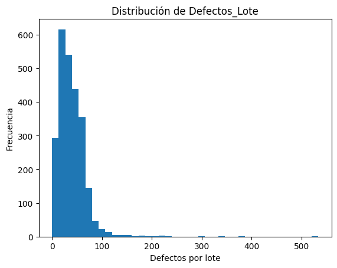
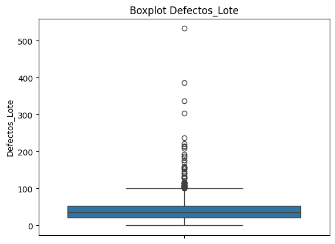
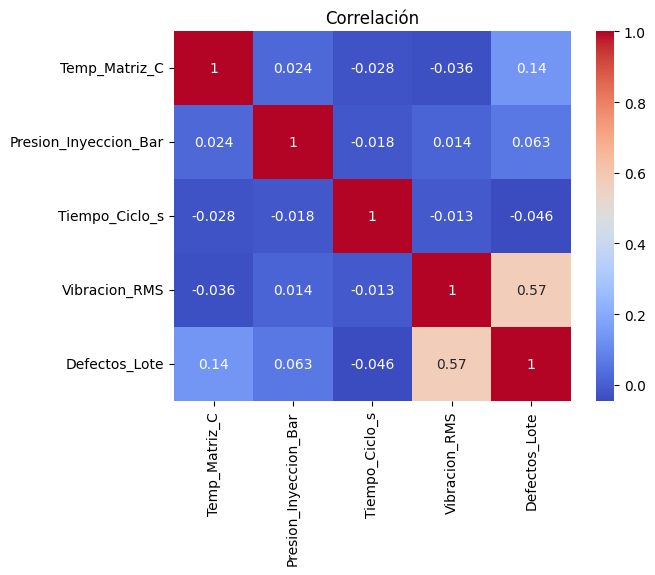
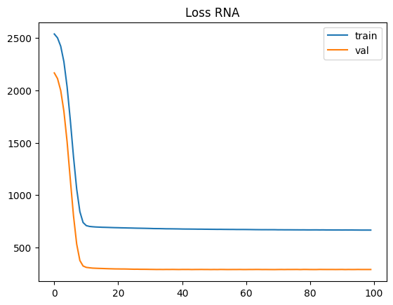
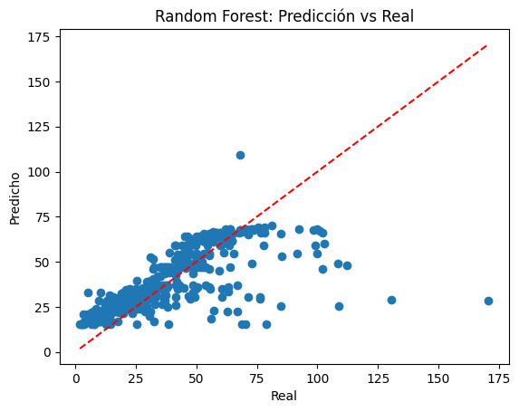

<div align="center">

# 02 · Control de Calidad Predictivo — Caso MetalX

**Predicción de piezas defectuosas por lote en un proceso de inyección de plástico**


</div>

---

## El problema

MetalX opera una línea de **inyección de plástico**. Cada lote producido tiene
una cantidad variable de piezas defectuosas, y detectarlas *después* de producir
implica desperdicio de material y de tiempo de máquina.

La pregunta del negocio es directa: **¿se puede anticipar el número de defectos
de un lote a partir de los sensores de la máquina, antes de terminarlo?**

---

## Los datos

**2 500 lotes**, sin valores nulos ni duplicados — un dataset limpio, lo que
desplaza el foco del proyecto desde el saneamiento hacia el modelado.

| Variable | Descripción | Rango observado |
|---|---|---|
| `Temp_Matriz_C` | Temperatura de matriz (°C) | 180.1 – 240.0 |
| `Presion_Inyeccion_Bar` | Presión de inyección (Bar) | 120.0 – 180.0 |
| `Tiempo_Ciclo_s` | Tiempo de ciclo (s) | 8.0 – 15.0 |
| `Vibracion_RMS` | Vibración RMS de la máquina | 1.5 – 6.5 |
| **`Defectos_Lote`** | **Variable objetivo** — defectos por lote | 0.0 – 533.3 |

### La variable objetivo es fuertemente asimétrica

| Estadístico | Valor |
|---|:--:|
| Media | 39.36 |
| Mediana | 34.88 |
| Máximo | **533.31** |
| Desviación estándar | 28.83 |
| **Asimetría (*skewness*)** | **4.65** |

Una asimetría de 4.65 con un máximo 15 veces superior a la mediana significa
que existe **una cola larga de lotes catastróficos**, poco frecuentes pero muy
costosos. Este dato condiciona todo lo que viene después.

<div align="center">


</div>

---

## 🔑 El hallazgo principal

<div align="center">

</div>

De las cuatro variables de proceso, **solo una explica los defectos**:

| Variable | Correlación con defectos | Importancia (Random Forest) |
|---|:--:|:--:|
| **`Vibracion_RMS`** | **0.57** | **89.3 %** |
| `Temp_Matriz_C` | 0.14 | 7.5 % |
| `Presion_Inyeccion_Bar` | 0.06 | 2.4 % |
| `Tiempo_Ciclo_s` | −0.05 | 0.8 % |

> **Traducción a planta:** la vibración RMS concentra casi nueve de cada diez
> unidades de poder predictivo. Instrumentar y **monitorear la vibración es la
> palanca de control de calidad más rentable** de este proceso, y justifica
> priorizar el mantenimiento predictivo de la máquina por encima del ajuste fino
> de temperatura, presión o tiempo de ciclo.

---

## Modelos evaluados

<div align="center">
<picture>
  <source media="(prefers-color-scheme: dark)" srcset="assets/comparativa-modelos-dark.png">
  
</picture>
</div>

| Modelo | Configuración | MAE | MSE | R² test |
|---|---|:--:|:--:|:--:|
| **🥇 Red Neuronal (RNA)** | Densa 16 → 8 → 1, ReLU + lineal, Adam, 100 épocas | **9.81** | **241.0** | **0.551** |
| 🥈 Random Forest | `GridSearchCV` → `max_depth=3`, `n_estimators=100` | 10.18 | 260.0 | 0.516 |
| 🥉 Árbol de Decisión | `GridSearchCV` → `max_depth=3` | 10.87 | 300.7 | 0.440 |

### Validación cruzada (5-fold, MSE)

| Modelo | CV MSE |
|---|:--:|
| Random Forest | **625.6** |
| Árbol de Decisión | 638.4 |

El MSE de validación cruzada (≈ 626) es más del doble que el MSE en test (260).
Esa brecha no es un error: refleja que **algunos pliegues concentran más lotes
atípicos que otros**, con la cola larga de la variable objetivo penalizando
fuertemente el error cuadrático. Es la señal estadística del mismo problema que
ya anunciaba la asimetría de 4.65.

<div align="center">


</div>

---

## Interpretación del techo de R² ≈ 0.55

Ningún modelo supera el 0.56, y conviene explicarlo en vez de disimularlo:

1. **Solo hay una variable informativa.** Con `Vibracion_RMS` cargando el 89 % y
   las otras tres aportando ruido, no hay suficiente señal para más.
2. **La cola larga es intrínsecamente impredecible con estos sensores.** Los
   lotes de 300–533 defectos probablemente responden a causas no medidas
   (calidad del lote de materia prima, desgaste de molde, paradas de línea).
3. **El error cuadrático castiga esos casos de forma desproporcionada**, y con
   ellos se hunde el R².

**Qué haría falta para mejorarlo:** transformar la variable objetivo
(`log1p`) para comprimir la cola, incorporar variables de materia prima y
mantenimiento, o **reformular el problema como clasificación** —
lote conforme / lote en riesgo— que es además la decisión que realmente toma un
supervisor de planta.

---

## Predicción sobre un caso nuevo

Ambos entregables cierran aplicando el modelo a un lote no visto:

```python
nuevo = pd.DataFrame([{
    "Temp_Matriz_C": 238.0,
    "Presion_Inyeccion_Bar": 178.0,
    "Tiempo_Ciclo_s": 8.5,
    "Vibracion_RMS": 6.3,          # vibración alta → mucho riesgo
}])

modelo_rf.predict(nuevo)   # → 69.53 defectos estimados
```

Frente a una mediana de 34.88 defectos, el modelo estima **casi el doble** para
este lote — consistente con una vibración de 6.3, cerca del máximo observado de
6.5. El modelo se comporta como debería.

---

## Archivos

| Archivo | Contenido |
|---|---|
| [`control_calidad_metalx.ipynb`](control_calidad_metalx.ipynb) | Notebook con todas las salidas y gráficos guardados |
| [`control_calidad_metalx.py`](control_calidad_metalx.py) | El mismo análisis como script ejecutable |
| `df_metalx.csv` | Dataset de 2 500 lotes (separador `;`) |
| `assets/` | Gráficos exportados |

> [!NOTE]
> El CSV usa **punto y coma** como separador: `pd.read_csv("df_metalx.csv", sep=";")`.
> El notebook lo carga por ruta relativa, así que ejecútalo desde esta carpeta.

<div align="center">
<sub><a href="../">← Volver al índice del repositorio</a></sub>
</div>
