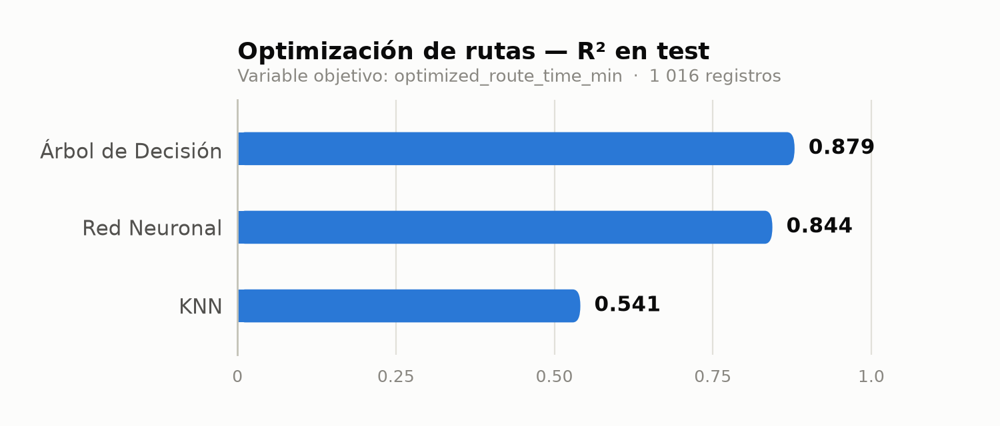
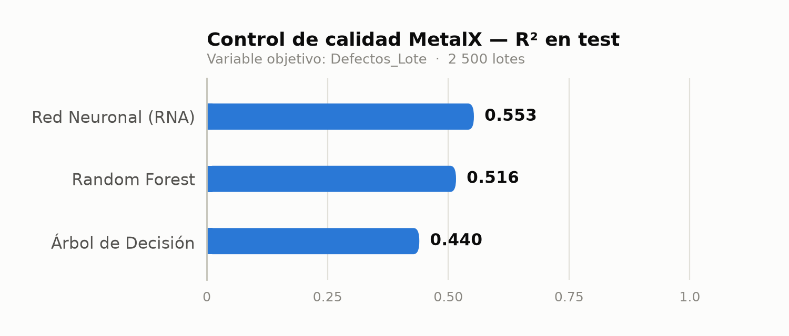

<div align="center">

# Machine Learning aplicado a Procesos Industriales

**Proyectos académicos de Ingeniería Industrial — Universidad Peruana de Ciencias Aplicadas (UPC)**

Analítica de datos, estadística avanzada y modelos predictivos aplicados a
problemas reales de logística y manufactura.

<br>


<br>

### [▶ Ver el panel de resultados interactivo](https://fcarruitero24.github.io/UPC_projects_exams/)

Incluye un **simulador de lote**: mueves los cuatro sensores de la máquina y el
Random Forest entrenado responde al instante — sin servidor, porque el modelo
(100 árboles, 56 KB) se ejecuta en el navegador.

</div>

---

## Los proyectos

| # | Proyecto | Problema | Mejor modelo | Métrica |
|:--:|---|---|---|:--:|
| **01** | [Optimización de rutas e-commerce](01-optimizacion-rutas-ecommerce/) | Predecir el tiempo de ruta optimizado a partir de variables logísticas | Árbol de Decisión | **R² = 0.879** |
| **02** | [Control de calidad — Caso MetalX](02-control-calidad-metalx/) | Predecir piezas defectuosas por lote en inyección de plástico | Red Neuronal (RNA) | **R² = 0.553** |

Ambos siguen el mismo flujo de trabajo: EDA → auditoría de calidad de datos →
limpieza → *feature engineering* → entrenamiento de 3 modelos → validación
cruzada de 5 pliegues → comparación y predicción sobre un caso nuevo.

---

## 01 · Optimización de rutas en e-commerce

Auditoría y modelado de un dataset logístico deliberadamente "sucio"
(1 030 registros, 18 columnas). El objetivo es predecir
`optimized_route_time_min` para apoyar decisiones sobre ventanas de entrega,
distancias y costos.

<div align="center">
<picture>
  <source media="(prefers-color-scheme: dark)" srcset="01-optimizacion-rutas-ecommerce/assets/comparativa-modelos-dark.png">
  
</picture>
</div>

| Modelo | MAE | RMSE | R² | R² validación cruzada |
|---|:--:|:--:|:--:|:--:|
| **Árbol de Decisión** *(GridSearchCV, `max_depth=5`)* | **15.06** | **24.30** | **0.879** | 0.856 |
| Red Neuronal (Keras) | 18.90 | 27.57 | 0.844 | — |
| KNN *(`k=7`)* | 28.28 | 47.28 | 0.541 | 0.616 |

**Lectura crítica del resultado.** Dos variables concentran el **99.1 %** de la
importancia del árbol: `average_speed_kmph` (50.3 %) y `distance_km` (48.8 %).
Esto no es casual — el modelo está reconstruyendo la relación física
*tiempo = distancia / velocidad*, lo que explica un R² tan alto con tan pocas
variables relevantes. Es un resultado válido como ejercicio de modelado, pero
en producción indicaría que **las 14 variables restantes no aportan información
predictiva** y que el problema real requiere una variable objetivo menos
determinada por sus propios predictores.

→ [Ver detalle del proyecto](01-optimizacion-rutas-ecommerce/)

---

## 02 · Control de calidad predictivo — Caso MetalX

Predicción de la cantidad de piezas defectuosas por lote (`Defectos_Lote`) en un
proceso de inyección de plástico, a partir de 4 variables de máquina medidas en
tiempo real sobre 2 500 lotes.

<div align="center">
<picture>
  <source media="(prefers-color-scheme: dark)" srcset="02-control-calidad-metalx/assets/comparativa-modelos-dark.png">
  
</picture>
</div>

| Modelo | MAE | MSE | R² |
|---|:--:|:--:|:--:|
| **Red Neuronal (RNA)** *(16→8→1, ReLU)* | **9.80** | **240.1** | **0.553** |
| Random Forest *(GridSearchCV)* | 10.18 | 260.0 | 0.516 |
| Árbol de Decisión *(GridSearchCV)* | 10.87 | 300.7 | 0.440 |

**El hallazgo del proyecto.** La **vibración RMS de la máquina concentra el
89.3 % de la importancia predictiva** (correlación de 0.57 con los defectos),
muy por encima de temperatura de matriz (7.5 %), presión de inyección (2.4 %) y
tiempo de ciclo (0.8 %). Traducido a planta: **monitorear la vibración es la
palanca de control de calidad más rentable** del proceso, y justifica priorizar
mantenimiento predictivo sobre el ajuste de los demás parámetros.

El techo de R² ≈ 0.55 se explica por la fuerte asimetría de la variable objetivo
(*skewness* = 4.65; mediana 34.9 defectos frente a un máximo de 533): los lotes
atípicos son difíciles de anticipar con solo cuatro sensores.

→ [Ver detalle del proyecto](02-control-calidad-metalx/)

---

## Stack técnico

| Área | Herramientas |
|---|---|
| Manipulación de datos | `pandas`, `numpy` |
| Visualización | `matplotlib`, `seaborn` |
| Estadística | `scipy.stats` (Kolmogorov-Smirnov, Spearman, IQR) |
| Machine Learning | `scikit-learn` (Decision Tree, Random Forest, KNN, GridSearchCV, K-Fold) |
| Deep Learning | `tensorflow` / `keras` (redes densas) |

---

## Estructura del repositorio

```
UPC_projects_exams/
├── 01-optimizacion-rutas-ecommerce/
│   ├── assets/                                  # gráficos exportados
│   ├── dirty_ecommerce_logistics_route_planning_dataset.csv
│   ├── optimizacion_rutas_ecommerce.ipynb
│   └── README.md
├── 02-control-calidad-metalx/
│   ├── assets/
│   ├── control_calidad_metalx.ipynb
│   ├── control_calidad_metalx.py                # mismo análisis como script
│   ├── df_metalx.csv
│   └── README.md
├── docs/
│   ├── index.html                               # panel publicado en GitHub Pages
│   └── src/
│       ├── build.py                             # regenera index.html desde los datos
│       └── template.html                        # plantilla sin los datos inyectados
├── requirements.txt
├── LICENSE
└── README.md
```

### Regenerar el panel

El panel no se edita a mano: `index.html` se genera reentrenando los modelos y
serializando el Random Forest dentro de la plantilla.

```bash
python docs/src/build.py
```

---

## Cómo ejecutarlo

```bash
git clone https://github.com/fcarruitero24/UPC_projects_exams.git
cd UPC_projects_exams

python -m venv .venv
source .venv/bin/activate        # en Windows: .venv\Scripts\activate

pip install -r requirements.txt
jupyter notebook
```

> [!NOTE]
> Los notebooks cargan los datasets por ruta relativa, así que deben ejecutarse
> desde la carpeta de su propio proyecto. Los notebooks ya vienen con todas las
> salidas y gráficos guardados: se pueden leer en GitHub sin ejecutar nada.

---

## Autor

**Fabrizio Carruitero** — Ingeniería Industrial, UPC
Datos y Machine Learning aplicados a procesos industriales

[](https://github.com/fcarruitero24)

<sub>Distribuido bajo licencia MIT. Los datasets son de uso académico.</sub>
